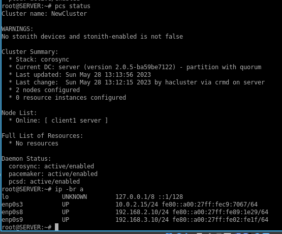
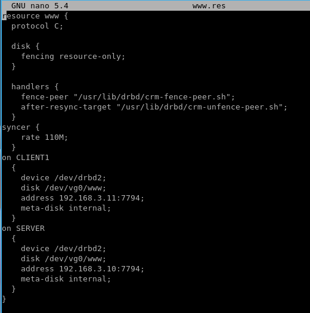

# Домашнее задание к занятию 10.3 «Pacemaker»

### Задание 1

#### Опишите основные функции и назначение Pacemaker.

*Приведите ответ в свободной форме.*

Это менеджер ресурсов с открытым кодом. Значит позволяет собирать данные с ресурсов с систем на которые он установлен.
---

### Задание 2

#### Опишите основные функции и назначение Corosync.

*Приведите ответ в свободной форме.*

Эта система необходима для создание отказоустойчивой системы. Собираются в несколько дублированных кластеров. Если один из кластеров выходит из строя то дублируемый кластер продолжает работу без сбоя общей системы.

---

### Задание 3

#### Соберите модель, состоящую из двух виртуальных машин. Установите Pacemaker, Corosync, Pcs. Настройте HA кластер.

*Пришлите скриншот рабочей конфигурации и состояния сервиса для каждого нода.*

станица  WEB

Сервисы "server"

Сервисы "client1"

### Задание 4

#### Установите и настройте DRBD-сервис для настроенного кластера.

