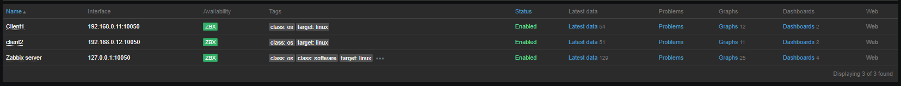

# Домашнее задание к занятию "9.2 Система мониторинга Zabbix"

### Цели задания
1. Научиться устанавливать Zabbix Server c веб-интерфейсом
2. Научиться устанавливать Zabbix Agent на хосты
3. Научиться устанавливать Zabbix Agent на компьютер и подключать его к серверу Zabbix
---

### Задание 1
Установите Zabbix Server с веб-интерфейсом.

#### Процесс выполнения
1. Выполняя ДЗ сверяйтесь с процессом отражённым в записи лекции.
2. Установите PostgreSQL. Для установки достаточна та версия что есть в системном репозитороии Debian 11
3. Пользуясь конфигуратором комманд с официального сайта, составьте набор команд для установки последней версии Zabbix с поддержкой PostgreSQL и Apache
4. Выполните все необходимые команды для установки Zabbix Server и Zabbix Web Server

#### Требования к результаты
1. Прикрепите в файл README.md скриншот авторизации в админке

2. Приложите в файл README.md текст использованных команд в GitHub

---

### Задание 2
Установите Zabbix Agent на два хоста.

#### Процесс выполнения
1. Выполняя ДЗ сверяйтесь с процессом отражённым в записи лекции.
2. Установите Zabbix Agent на 2 виртмашины, одной из них может быть ваш Zabbix Server
3. Добавьте Zabbix Server в список разрешенных серверов ваших Zabbix Agentов
4. Добавьте Zabbix Agentов в раздел Configuration > Hosts вашего Zabbix Servera
5. Проверьте что в разделе Latest Data начали появляться данные с добавленных агентов

#### Требования к результаты
1. Приложите в файл README.md скриншот раздела Configuration > Hosts, где видно, что агенты подключены к серверу

2. Приложите в файл README.md скриншот лога zabbix agent, где видно, что он работает с сервером

3. Приложите в файл README.md скриншот раздела Monitoring > Latest data для обоих хостов, где видны поступающие от агентов данные.

4. Приложите в файл README.md текст использованных команд в GitHub

